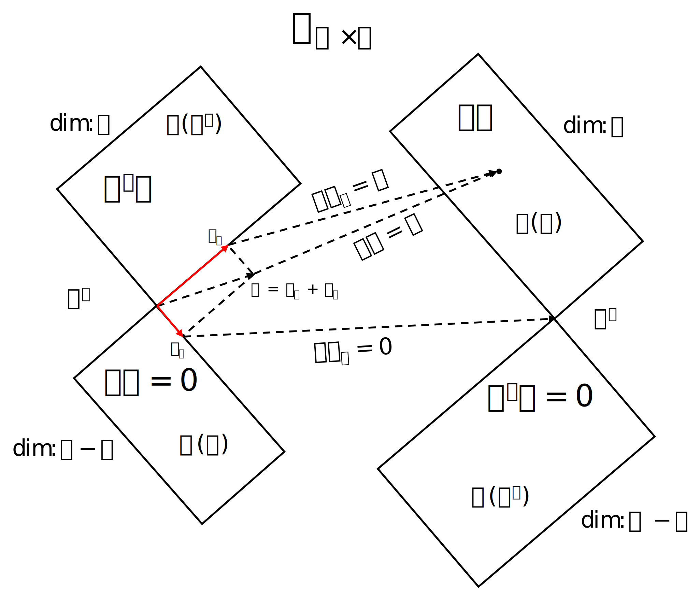

# Subspaces

## Def.10

Let $V_1$ and $V_2$ be two subspaces of a Euclidean space $V$. If for any $\alpha \in V_1$ and $\beta \in V_2$, it always holds that:
$$
(\alpha, \beta) = 0
$$
Then $V_1$ and $V_2$ are said to be orthogonal, denoted by $V_1 \perp V_2$.

For a vector $\alpha$, if for any $\beta \in V_1$, it always holds that:
$$
(\alpha, \beta) = 0
$$
Then $\alpha$ is said to be orthogonal to the subspace $V_1$, denoted by $\alpha \perp V_1$.

## Th.5

If the subspaces $V_1, V_2, \cdots, V_s$ are pairwise orthogonal, then the sum $V_1 + V_2 + \cdots + V_s$ is a direct sum.

### Pf.

Let $\alpha_i \in V_i(i = 1,2, \cdots, s)$, and
$$
\alpha_1 + \alpha_2 + \cdots + \alpha_s = 0,
$$
Now we need to prove $\alpha_i = 0$.

Actually, we take the inner product of both sides with $\alpha_i$, then we get:
$$
(\alpha_i, \alpha_i) = 0
$$
So $\alpha_i = 0(i = 1,2,\cdots,s)$.

That is to say, the sum $V_1 + V_2 + \cdots + V_s$ is a direct sum.

## Def.11

A subspace $V_2$ is called the orthogonal complement of the subspace $V_1$ if $V_1 \perp V_2$ and $V_1 + V_2 = V$, denoted as $V_2 = V_1^{\perp}$

If $V_2$ is an orthogonal complement of $V_1$, then $V_1$ is also an orthogonal complement of $V_2$.

## Th.6

Every subspace $V_1$ of an n-dimensional Euclidean space $V$ has a unique orthogonal complement.

### Pf.

First, let's prove the existence of Theorem 6.

If $V_1 = \{0\}$, then its orthogonal complement is $V$ Itself, and the uniqueness is obvious.

Assume $V_1 \neq \{ 0 \}$.

A subspace of a Euclidean space is also a Euclidean space under the defined inner product.

Take an orthogonal basis $\epsilon_1, \epsilon_2, \cdots, \epsilon_m$ in $V_1$.

By Theorem 1, this can be extended to form an orthogonal basis for $V$:
$$
\epsilon_1, \epsilon_2, \cdots, \epsilon_m, \epsilon_{m+1}, \cdots, \epsilon_n.
$$
So the subspace $L(\epsilon_{m+1} , \cdots, \epsilon_n)$ is an orthogonal complement of $V_1$.

Second, let's prove the uniqueness of Theorem 6.

Let $V_2$ and $V_3$ both be orthogonal complements of $V_1$.

Thus, we have the direct sums:
$$
V = V_1 \oplus V_2 \quad (1) \\ V = V_1 \oplus V_3 \quad (2)
$$
Let $\alpha \in V_2$, then $\alpha$ also in $V$, which means $\alpha$ also can be decomposed to $\alpha_1 + \alpha_3$.

From equation (2), we have:
$$
\alpha = \alpha_1 + \alpha_3
$$
Where $\alpha_1 \in V_1$ and $\alpha_3 \in V_3$.

Because $\alpha \perp \alpha_1$, we have:
$$
(\alpha, \alpha_1) = (\alpha_1 + \alpha_3, \alpha_1) = (\alpha_1, \alpha_1) + (\alpha_3, \alpha_1) = (\alpha_1, \alpha_1) = 0
$$
This implies $\alpha_1 = 0$.

From this, we know that $\alpha = \alpha_3$, so $\alpha \in V_3$.

That is to say, $V_2 \sub V_3$.

Similarly, it can be proven that $V_3 \sub V_2$.

Therefore, $V_2 = V_3$.

This proof is done.

According to the definition, we know that $\text{dim}(V_1) + \text{dim}(V_1^{\perp}) = n$.

## Co.

$V_1^{\perp}$ consists precisely of all vectors that are orthogonal to $V_1$.

### Pf.

We need to prove that the subspace $V_1^{\perp}$ is equal to the set of all vectors orthogonal to $V_1$.

Let $S$ be the set of all vectors orthogonal to $V_1$:
$$
S = \set{x \in V| (x, v) = 0 \  \text{for all } v \in V_1 }.
$$
First, we prove that $V_1^{\perp} \sub S$.

For any vector $\alpha \in V_1^{\perp}$ and $\beta \in V_1$, we have $(\alpha, \beta) = 0$.

So $\alpha \in S$.

That is to say, $V_1^{\perp} \sub S$.

Second, we prove that $S \sub V_1^{\perp}$.

For any vector $\gamma \in S$, we have $\gamma \in V$.

So, $\gamma = v_1 + v_2$, where $v_1 \in V_1$ and $v_2 \in V_1^{\perp}$.

According to the definition of S, we have $(x, v_1) = 0$.
$$
\begin{aligned}
&(v_1 + v_2, v_1) = 0\\
\Rightarrow\ &(v_1, v_1) + (v_2, v_1) = 0\\
\Rightarrow\ &(v_1, v_1) = 0\\
\Rightarrow\ &v_1 = 0\\
\Rightarrow\ &\gamma = 0 + v_2 = v_2 \in V_1^{\perp}.
\end{aligned}
$$
That is to say, $S \sub V_1^{\perp}$.

So, $S = V_1^{\perp}$.

From the decomposition formula
$$
V = V_1 \oplus V_1^{\perp}
$$
it follows that any vector $\alpha$ in $V$ can be uniquely decomposition into:
$$
\alpha = \alpha_1 + \alpha_2
$$
where $\alpha_1 \in V_1$ and $\alpha_2 \in V_1^{\perp}$.

We call $\alpha_1$ the orthogonal projection of the vector $\alpha$ onto the subspace $V_1$.

This is the Whole Big Picture of $A_{m \times n}$.

- $x \in \R^n, \ y \in \R^m$.

- $C(A^T)$ : Row Space
- $C(A)$ : Column Space
- $N(A)$ : Nullspace
- $N(A^T)$ : Left Nullspace
- $A(\text{row space + nullspace}) = \text{column space}$
- $A^T(\text{colunm space + left nullspace}) = \text{row space}$
