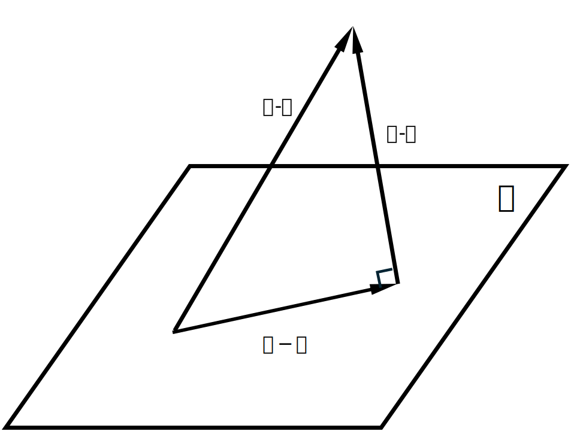

# The Least Squares Method

## Def.13

The length $|\alpha - \beta|$ is called the distance between the vectors $\alpha$ and $\beta$, denoted by $d(\alpha, \beta)$.

It is not difficult to prove the three basic properties of distance:

1. $d(\alpha, \beta) = d(\beta, \alpha)$.
2. $d(\alpha, \beta) \geq 0$, and the equality holds if and only if $\alpha = \beta$.
3. $d(\alpha, \beta) \leq d(\alpha, \gamma) + d(\gamma, \beta)$

### Pf.

First
$$
\begin{aligned} 
d(\alpha, \beta) &= |\alpha - \beta| \\
&= |(-1)(\beta - \alpha)| \\
&= |-1| \cdot |\beta - \alpha| \\
&= |\beta - \alpha| \\
&= d(\beta, \alpha)
\end{aligned}
$$
Second
$$
\begin{aligned}  

d(\alpha, \beta) = 0 &\Longleftrightarrow |\alpha - \beta| = 0 \\
&\Longleftrightarrow \alpha - \beta = 0 \\
&\Longleftrightarrow \alpha = \beta.

\end{aligned}
$$
Third

Let $u = \alpha - \gamma$ and $v = \gamma - \beta$.

We have
$$
u + v = \alpha - \beta
$$
We invoke the standard Triangle Inequality for Vector Norms, which states $|u + v| \leq |u| + |v|$.

Substituting our terms back in:
$$
\begin{aligned}
|\alpha - \beta| &= |u + v| \\
&\leq |u| + |v| \\
&= |\alpha - \gamma| + |\gamma - \beta|.
\end{aligned}
$$
Therefore:
$$
d(\alpha, \beta) \leq d(\alpha, \gamma) + d(\gamma, \beta).
$$

## Pt.

The distance between a fixed vector and the vectors in a subspace also follows the principle of "shortest perpendicular".

### Pf.

First, let $W$ be a subspace generated by the vectors $\alpha_1, \cdots, \alpha_k$, i.e., $W = L(\alpha_1, \cdots, \alpha_k)$.

A vector $\alpha$ is said to be orthogonal to the subspace $W$ if $\alpha$ is orthogonal to any vector in $W$.

$\alpha$ is orthogonal to $W$ if and only if $\alpha$ is orthogonal to every $\alpha_i$.

Now, given a fixed vector $\beta$, let $\gamma$ be a vector in $W$ satisfying that $\beta - \gamma$ is perpendicular to $W$.

We want to prove that the distance from $\beta$ to the vectors in $W$ is the shortest along the perpendicular.

That is to say, we want to prove that for any vector $\boldsymbol{\delta}$ in $W$, we have
$$
|\beta - \gamma| \leq |\beta - \delta|.
$$
$\beta - \delta = (\beta - \gamma) + (\gamma - \delta)$.

Since $W$ is a subspace, and $\gamma \in W$, $\delta \in W$, then $\gamma - \delta \in W$.

Therefore, $\beta - \gamma$ is perpendicular to $\gamma - \delta$.

By the Pythagorean theorem,
$$
|\beta - \gamma|^2 + |\gamma - \delta|^2 = |\beta - \delta|^2
$$
Thus,
$$
|\beta - \gamma| \leq |\beta  - \delta|.
$$

## Def. The Least Squares Method

Consider the following system of linear equations:
$$
\begin{cases}
a_{11}x_1 + a_{12}x_2 + \dots + a_{1s}x_s - b_1 = 0, \\
a_{21}x_1 + a_{22}x_2 + \dots + a_{2s}x_s - b_2 = 0, \\
\dots\dots\dots\dots\dots \\
a_{n1}x_1 + a_{n2}x_2 + \dots + a_{ns}x_s - b_n = 0
\end{cases}
$$
The system may be inconsistent. 

This implies that for any ordered set of scalars $x_1, \cdots, x_s$ the residuals may be non-zero.

Specifically, the following expression may not vanish:
$$
\sum_{i = 0}^n(a_{i1}x_1 + a_{i2}x_2 + \cdots + a_{is}x_s - b_i)^2 \tag1
$$
Our objective is to determine the values $x_1^0, x_2^0, \cdots, x_s^0$ that minimize the objective function (1).

The vector defined by $x_1^0, x_2^0, \cdots, x_s^0$ is designated as the least squares solution of the system.

This class of optimization problems is the Least Squares Problem.

In the following section, we employ the formalism of Euclidean space to characterize the method of least squares and derive the algebraic conditions satisfied by the least squares solution.

Let us define the following matrices and vectors:
$$
A = \begin{bmatrix} 
a_{11} & a_{12} & \cdots & a_{1s}\\
a_{21} & a_{22} & \cdots & a_{2s}\\
\vdots & \vdots & & \vdots\\
a_{n1} & a_{n2} & \cdots & a_{ns}
\end{bmatrix}, \quad
B = \begin{bmatrix} 
b_1\\ b_2\\ \vdots \\ b_n
\end{bmatrix}, \quad 
X = \begin{bmatrix}
x_1\\ x_2\\ \vdots\\ x_s
\end{bmatrix}, \quad
Y = AX = \begin{bmatrix} \sum_{j=1}^sa_{1j}x_j\\ \sum_{j=1}^sa_{2j}x_j\\ \vdots \\\sum_{j=1}^sa_{nj}x_j\\ \end{bmatrix}. \tag2
$$
Utilizing the metric defintion of distance in Euclidean space, expression (1) is equivalent to the squared Euclidean norm:
$$
|AX - B|^2 = |Y - B|^2.
$$
Consequently, the least squares method seeks to identify $x_1^0, \cdots, x_s^0$ such that the distance between the vector $Y$ and target vector $B$ is minimized.

From equation (2), we observe that the vector $Y$ can be expressed as a linear combination of the columns of $A$:
$$
Y = x_1\begin{bmatrix} a_{11}\\ a_{21}\\ \vdots\\ a_{n1} \end{bmatrix} + x_2\begin{bmatrix} a_{12}\\ a_{22}\\ \vdots\\ a_{n2} \end{bmatrix} + \cdots + x_s\begin{bmatrix} a_{1s}\\ a_{2s}\\ \vdots\\ a_{ns} \end{bmatrix}.
$$
Let us denote the column vectors of matrix $A$ as $\alpha_1, \alpha_2, \cdots, \alpha_s$.

The subspace generated by these vectors is denoted by $L(\alpha_1, \cdots, \alpha_s)$.

Therefore, $Y$ is a vector residing within the subspace $L(\alpha_1, \cdots, \alpha_s)$.

Thus, the Least Squares Problem can be rigorously formulated as follows:

Finding the vector $X$ that minimizes the objective function (1) is equivalent to locating a vector $Y$ within the subspace $L(\alpha_1, \cdots, \alpha_s)$ such that the distance from the target vector $B$ to $Y$ is strictly less than or equal to the distance from $B$ to any other vector within that subspace.

Let
$$
Y = AX = x_1\alpha_1 + x_2\alpha_2 + \cdots + x_s\alpha_s
$$
be the required vector.

Then, the residual vector
$$
C = B - Y = B - AX
$$
must be orthogonal to the subspace $L(\alpha_1, \alpha_2, \cdots, \alpha_s)$.

So, the residual vector is orthogonal to the subspace if and only if the inner product of $C$ with each basis vector is zero:
$$
(C, \alpha_1) = (C, \alpha_2) = \cdots = (C, \alpha_s) = 0.
$$
That is to say,
$$
\alpha_1^TC = 0, \quad \alpha_2^TC = 0, \quad \cdots, \quad \alpha_s^TC = 0.
$$
$(\alpha_1^T, \cdots, \alpha_s^T)$ is the $A^T$, so we have:
$$
A^T(B - AX) = 0,
$$
or equivalently,
$$
A^TAX = A^TB.
$$
This is the system of algebraic equations satisfied by the least squares solution.

It is a system of linear equations where the coefficient matrix is $A^TA$ and the constant term vector is $A^TB$.

This linear system is always consistent.
